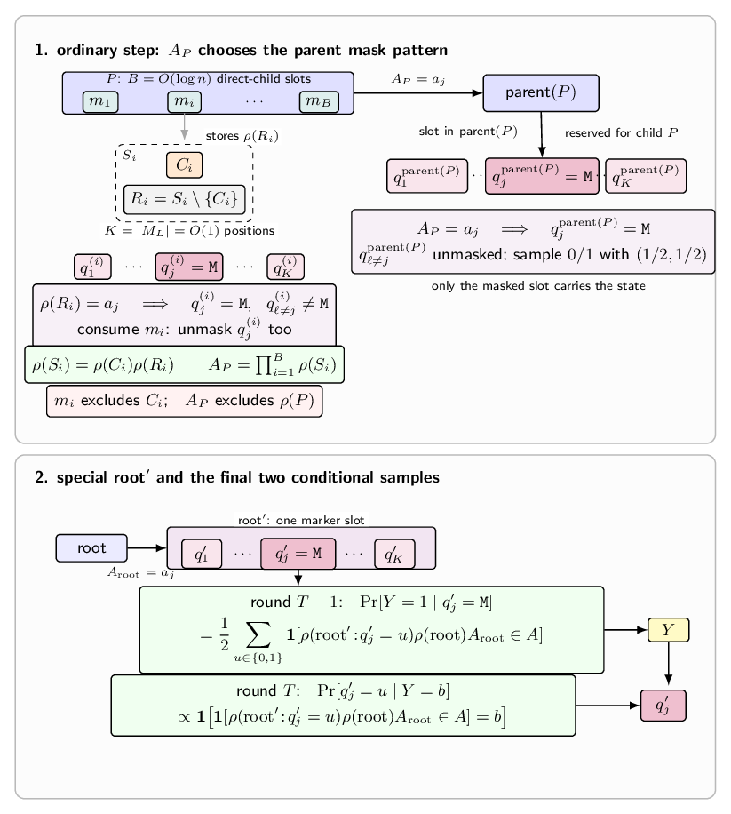

This note studies exact sampling round complexity for diffusion language
models, with and without revision. Sampling always means equality with the
target distribution. Remasking counts as revision because an update such as
$0\to M$ changes an unmasked coordinate.

Every fixed binary regular-language input-output pair distribution is
sampleable in at most two rounds with revision and in
$O(\log n/\log\log n)$ rounds without revision. For languages outside $AC^0$,
the no-revision complexity is $\Theta(\log n/\log\log n)$. The same bounds hold
in a Transformer model specified below.

## Model conventions and preliminaries

We use the binary vocabulary

$$
V=\{0,1\},
$$

together with a mask symbol $M$. For sequence length $N$, the state space is
$(V\cup\{M\})^N$. We consider unconditional generation, so the initial state is

$$
x^{(0)}=M^N.
$$

The standard, no-revision DLM follows the usual masked-decoding rule from
Jiang, Haghtalab, and Chen [1]: an unmasking policy $F$ first chooses which
currently masked positions to decode, and only those positions are sampled.
Once a position is unmasked, it cannot change.

```text
No-revision DLM
Input: length N, rounds D, predictor p, unmasking policy F
Initialize x <- M^N
for t = 1,...,D:
    S <- F(x)                         // S must be a subset of {i : x_i = M}
    for each i in S independently:
        x_i ~ p_i(. | x) over {0,1}
    all positions outside S stay unchanged
Output x
```

With revision, we use the simpler abstraction that there is no separate
unmasking policy. Every position is updated in every round, and each coordinate
may freely take values in $\{0,1,M\}$. This includes remasking, since a
transition such as $0\to M$ is allowed.

```text
DLM with revision
Input: length N, rounds D, predictor p
Initialize x <- M^N
for t = 1,...,D:
    for each i in [N] independently:
        x_i ~ p_i(. | x) over {0,1,M}
Output x                              // for sampling over {0,1}^N, x has no M
```

For a target distribution over $\{0,1\}^N$, a valid sampler must output a fully
unmasked string with probability $1$.

### Regular-language input-output pair distributions

Let $L\subseteq\{0,1\}^*$ be a fixed regular language, and let
$f_L(x)=\mathbf{1}[x\in L]$. For every $n\ge1$, define

$$
\mathcal{D}^{\mathrm{pair}}_{L,n}
  =
  \mathrm{Unif}\{(x,f_L(x)):x\in\{0,1\}^{n}\}.
$$

The sampled sequence has $n+1$ coordinates: $n$ input characters and one
label.

## $AC^0$ regime

$AC^0$ is the class of Boolean functions computable by polynomial-size,
constant-depth circuits with unbounded-fan-in AND and OR gates, together with
NOT gates. It captures computations with a fixed number of highly parallel
layers, but without a growing chain of sequential dependence. A standard
consequence is that global functions such as parity are not in $AC^0$.

In this section, each local predictor is a randomized-$AC^0$ circuit using at
most polynomially many independent fair bits. The no-revision policy $F$ is a
deterministic $AC^0$ circuit.

This circuit model is motivated by Li, Liu, Zhou, and Ma [2, Theorem 3.8], who
show that non-uniform, constant-depth, polynomial-width Transformers with
constant-bit precision have exactly the expressive power of $AC^0$ for
deterministic Boolean computation. The final section explains how the relevant
$AC^0$ updates are implemented in this Transformer model.

### Round complexity for regular languages

**Theorem 1 (two-round revision sampling).** For every fixed binary regular
language $L$ and every $n\ge1$, a randomized-$AC^0$ DLM with revision samples
$\mathcal{D}^{\mathrm{pair}}_{L,n}$ in at most two rounds.

**Proof.** Fix a DFA
$\mathcal A=(Q,\{0,1\},\delta,q_0,F_{\mathcal A})$ for $L$.
The construction in [3, Corollary 11] uses at most $n$ fair bits for the DFA
trajectory. In round one,
sample the first $n$ coordinates independently and uniformly, and set the label
coordinate to $0$. In round two, map the first-round bits to the state
trajectory $(Y_0,\ldots,Y_n)$ and update each input coordinate according to

$$
\Pr[X_{i+1}=a\mid Y_i,Y_{i+1}]
=
\frac{\mathbf 1[\delta(Y_i,a)=Y_{i+1}]}
{\sum_{b\in\{0,1\}}\mathbf 1[\delta(Y_i,b)=Y_{i+1}]},
$$

for $0\le i<n$ and $a\in\{0,1\}$. These updates are coordinatewise once the
trajectory is fixed. Set the label to
$\mathbf 1[Y_n\in F_{\mathcal A}]$. The output law is
$\mathcal{D}^{\mathrm{pair}}_{L,n}$. $\square$

**Theorem 2 (no-revision sampling).** In the randomized-$AC^0$ no-revision
model, every fixed binary regular language $L$ satisfies:

1. if $L\notin AC^0$, then $\mathcal{D}^{\mathrm{pair}}_{L,n}$ needs
   $\Omega(\log n/\log\log n)$ rounds without revision;
2. $\mathcal{D}^{\mathrm{pair}}_{L,n}$ has an
   $O(\log n/\log\log n)$-round no-revision sampler.

**Proof.** For the lower bound, suppose there is a $D$-round no-revision
sampler for $\mathcal{D}^{\mathrm{pair}}_{L,n}$. Its support contains one
output pair for each input:

$$
\Pr[(X,Y)=(x,b)]
  =
  \begin{cases}
  2^{-n}, & b=f_L(x),\\
  0, & b\ne f_L(x).
  \end{cases}
$$

Because $F$ is deterministic and decoded bits never change, each output
determines a unique complete trace. Every positive trace therefore has
probability $2^{-n}$. Write each positive dyadic local factor as
$m_j/2^{r_j}$. Since their product is $2^{-n}$, every $m_j$ is a power of two,
so every factor has the form $2^{-a_j}$.

Now consider a reachable binary local choice. If both outcomes have positive
probability, completing each branch to a positive output shows that
$p=2^{-a}$ and $1-p=2^{-b}$ for integers $a,b\ge 1$. The identity
$2^{-a}+2^{-b}=1$ forces $a=b=1$. Thus every reachable local binary
distribution is $(1,0)$, $(0,1)$, or $(1/2,1/2)$. In particular, every
positive local branch has probability at least $1/2$.

Therefore the candidate output $(x,1)$ has positive probability if and only if
$x\in L$. We can test this support event by tracing the sampler along the
candidate output. At each no-revision step, use the sampler's unmasking policy
$F$ and predictor $p$; if a required local value has probability $0$, reject,
and otherwise estimate positivity by repeated independent draws from the same
local predictor.

```text
SupportTest(x)
Input: x in {0,1}^n
Set x' <- (x,1)
Set state s <- M^{n+1}
for t = 1,...,D:
    S <- F(s)
    if S is not a subset of {i : s_i = M}, reject
    for each i in S:
        draw k independent samples from p_i(. | s)
        if none of the k samples equals x'_i, reject
        set s_i <- x'_i
accept iff s = x'
```

The rigidity argument above shows that every positive local branch on such a
trace has probability at least $1/2$. Enumerate all reachable positive local
judgments $(s,i,b)$: there are at most $2(n+1)3^{n+1}=O(n\,3^n)$ of them.
Using the same $k$ fresh random blocks for every such judgment, $k$
independent samples miss a fixed positive judgment with probability at most
$2^{-k}$. Taking

$$
k=\left\lceil\log_2\bigl(2(n+1)3^{n+1}\bigr)\right\rceil+1
  =O(n)
$$

gives

$$
\Pr[\text{some reachable positive judgment is missed}]
  \le 2(n+1)3^{n+1}\,2^{-k}<1.
$$

Hence one fixed seed, of length $k\cdot\mathrm{poly}(n)=\mathrm{poly}(n)$,
makes every reachable positive decision correct, while zero-probability
decisions are never accepted. Hardwiring this seed turns the unrolled
$D$-round procedure into a deterministic polynomial-size AND/OR/NOT recognizer
for $L$ of depth $O(D)$. The regular-language lower bound therefore gives

$$
D=\Omega\left(\frac{\log n}{\log\log n}\right)
$$

whenever $L\notin AC^0$.



For the matching upper bound, use the standard finite-monoid product tree for
regular languages. Lay the tree out in depth-first index order, so that each
subtree occupies a contiguous coordinate interval, including the internal
positions assigned to its root. Fix a finite monoid $M_L$, a morphism

$$
\rho:\{0,1\}^*\to M_L,
$$

and an accepting set $F_{\mathrm{acc}}\subseteq M_L$ such that

$$
f_L(x)=\mathbf{1}[\rho(x)\in F_{\mathrm{acc}}].
$$

Equivalently, $\rho(w)$ records the DFA transition induced by a substring $w$;
applied to the start state, it gives the DFA state after reading $w$.

Enumerate

$$
M_L=\{a_1,\ldots,a_K\},
\qquad K=|M_L|=O(1),
$$

and take a branching factor $B=\Theta(\log n)$. The sampler uses a
$B$-ary product tree over the first $n$ output coordinates. A marker slot is
not an extra alphabet symbol: it is a constant-size block of ordinary output
coordinates whose mask pattern carries a monoid value. In the convention used
below, one coordinate in the slot is masked, and the index of that
masked coordinate encodes the value.

At an ordinary node $P$, write its direct-child subtrees in string order as

$$
S_1,\ldots,S_B.
$$

For each child subtree $S_i$, let $C_i$ be the root coordinate of that subtree
and let

$$
R_i=S_i\setminus\{C_i\}.
$$

The slot $m_i$ reserved for child $S_i$ consists of $K$ positions

$$
q^{(i)}_1,\ldots,q^{(i)}_K.
$$

It stores only the remainder value $\rho(R_i)$, not the root coordinate
$C_i$, by the one-mask convention

$$
\rho(R_i)=a_j
\quad\Longleftrightarrow\quad
q^{(i)}_j=\mathtt M,\qquad q^{(i)}_{\ell\ne j}\ne\mathtt M.
$$

When this child slot is consumed, the slot's still-masked coordinate is also
unmasked and sampled as a fair bit. After the coordinate $C_i$ is sampled, the
predictor can compute

$$
\rho(S_i)=\rho(C_i)\rho(R_i).
$$

The value passed from $P$ to $\mathrm{parent}(P)$ is then

$$
A_P=\prod_{i=1}^{B}\rho(S_i).
$$

As in the figure, $A_P$ still excludes $\rho(P)$ itself. If $A_P=a_j$, then in
the slot of $\mathrm{parent}(P)$ reserved for child $P$ the next round creates
the mask pattern

$$
q^{\mathrm{parent}(P)}_j=\mathtt M,\qquad
q^{\mathrm{parent}(P)}_{\ell\ne j}\ne\mathtt M,
$$

sampling every newly unmasked
$q^{\mathrm{parent}(P)}_{\ell\ne j}$ as a fair bit. At the same time, the
consumed marker positions inside $P$ are also unmasked, including the unique
previously masked coordinate in each consumed child slot. Since $K$ is constant
and $B=\Theta(\log n)$, the map

$$
\bigl(\rho(S_1),\ldots,\rho(S_B)\bigr)\mapsto A_P
$$

is a polynomial-size $AC^0$ table lookup. One such upward step is performed in
parallel at every node on the current tree level. The height is therefore

$$
O(\log_B n)=O\left(\frac{\log n}{\log\log n}\right).
$$

At the top, add the special node $\mathrm{root}^{\prime}$. Unlike an ordinary
node, $\mathrm{root}^{\prime}$ has only one marker slot

$$
q^{\prime}_1,\ldots,q^{\prime}_K.
$$

After the root coordinate has been sampled, the upward pass stores the root
aggregate $A_{\mathrm{root}}$ in this slot:

$$
A_{\mathrm{root}}=a_j
\quad\Longleftrightarrow\quad
q^{\prime}_j=\mathtt M,\qquad q^{\prime}_{\ell\ne j}\ne\mathtt M.
$$

At this point the only masks are $q^{\prime}_j$ and the final output coordinate
$Y$. The hidden bit $q^{\prime}_j$ is still an ordinary prefix coordinate and
should be fair in the final output. The last two rounds sample $Y$ first and
then sample this hidden bit from the correct posterior.

$$
\Pr[Y=1\mid q^{\prime}_j=\mathtt M]
  =
  \frac12
  \sum_{u\in\{0,1\}}
  \mathbf{1}\!\left[
    \rho(\mathrm{root}^{\prime}\!:\!q^{\prime}_j=u)
    \rho(\mathrm{root})A_{\mathrm{root}}\in F_{\mathrm{acc}}
  \right],
$$

then, after $Y=b$ is visible,

$$
\Pr[q^{\prime}_j=u\mid Y=b]
  \propto
  \mathbf{1}\!\left[
    \mathbf{1}\!\left[
      \rho(\mathrm{root}^{\prime}\!:\!q^{\prime}_j=u)
      \rho(\mathrm{root})A_{\mathrm{root}}\in F_{\mathrm{acc}}
    \right]=b
  \right].
$$

The factor $1/2$ in the first formula is the prior probability of the hidden
fair bit $q^{\prime}_j=u$. The second formula is the corresponding posterior
after observing $Y=b$. Thus every prefix coordinate, including the marker
coordinate resolved at the end, is uniform, and the final coordinate equals
$Y=f_L(X)$.

### Parity as a corollary

Let

$$
L=
\left\{
x\in\{0,1\}^*:
\sum_{i=1}^{|x|}x_i\equiv1\pmod 2
\right\}.
$$

Then $\mathcal{D}^{\mathrm{pair}}_{L,n}$ is the uniform even-parity
distribution on $n+1$ bits.

**Corollary 3 (parity separation).** The no-revision round complexity of
$\{\mathcal{D}^{\mathrm{pair}}_{L,n}\}_{n\ge1}$ is
$\Theta(\log n/\log\log n)$, while its revision round complexity is exactly
$2$ for every $n\ge1$.

**Proof.** Since $L\notin AC^0$, Theorem 2 gives the no-revision claim.
Theorem 1 gives a two-round revision sampler. A one-round update from
$M^{n+1}$ is a product distribution, whereas
$\mathcal{D}^{\mathrm{pair}}_{L,n}$ is not. Thus one round is impossible.
$\square$

## Transformer regime

We adapt the method of Li, Liu, Zhou, and Ma [2].

To start, write

$$
\mathbb F_s=\mathbb F_{0,s},\qquad
B_s=\max\mathbb F_s=2^s-2^{-s},
$$

as our finite-precision model for a constant $s\ge2$. Thus $B_s$ is the largest
representable number, and $[\cdot]_s$ denotes rounding into $\mathbb F_s$.
The value $B_s$ enters through two opposite overflow regimes: saturation
$[\exp(B_s)]_s=B_s$ makes attention copy exactly, while underflow
$[\exp(-B_s)]_s=0$ produces exact zero probabilities.

At each round, the Transformer backbone first computes a positionwise logit
vector. For the predictor, apply rounded softmax to obtain probabilities
$p_1,\ldots,p_{|V|}$ in a fixed token order. Draw $z$ uniformly from the
finite-precision grid in $[0,1)$ and output the first token $j$ such that

$$
z<\sum_{i=1}^{j}p_i.
$$

The draws are independent across updated positions. Once the logits are
given, this inverse-CDF decoding is a randomized-$AC^0$ computation because
the vocabulary and precision are constant. The no-revision policy instead
computes logits over the two actions and takes their argmax, which is an
$AC^0$ computation once the logits are given.

Li, Liu, Zhou, and Ma prove the equivalence between $AC^0$ and next-token
prediction by constant-depth, polynomial-width, constant-precision
Transformers, with the predicted token selected by argmax [2]. Their statement
uses a decoder-only Transformer, but both directions extend directly to our
bidirectional model: the original construction gathers the input at the last
position, whereas bidirectional attention allows every position to gather it.

Equivalently, a positionwise finite-precision logit vector is computable by
this Transformer model if and only if it is $AC^0$-computable. The forward
direction follows directly from [2]. Conversely, write a desired logit as

$$
z=\sum_i z_i2^i,
\qquad z_i\in\{-1,0,1\}.
$$

If the logit is $AC^0$-computable, each digit $z_i$ is $AC^0$-computable. The
Transformer construction stores these digits in the hidden dimension, and the
final output projection matrix assigns weight $2^i$ to digit $z_i$, thereby
reassembling $z$ exactly. This proves the logit-level equivalence needed for
both transfers below.

### Lower-bound transfer

The Transformer computes $AC^0$ logits, after which the predictor applies
randomized-$AC^0$ decoding and the policy applies $AC^0$ argmax. Thus the
resulting DLM satisfies the randomized-$AC^0$ regime above, so the no-revision
lower bound in Theorem 2 transfers unchanged.

### Upper-bound realization

For the upper bounds, every choice among the required policy and predictor
logits is an $AC^0$ function of the current state, so the logit-level
equivalence gives a Transformer realization. The policy uses $(0,-B_s)$ for
hold and $(-B_s,0)$ for unmask. The predictor constructions use the following
positionwise logit vectors over $\{0,1,M\}$:

$$
(0,-B_s,-B_s),
\qquad
(-B_s,0,-B_s),
\qquad
(0,0,-B_s),
$$

whose rounded softmax is exactly

$$
(1,0,0),
\qquad
(0,1,0),
\qquad
(\tfrac12,\tfrac12,0).
$$

Indeed, $[\exp(-B_s)]_s=0$ and $[\exp(0)]_s=1$, and the denominator
$1+1=2$ is exactly representable when $s\ge2$, so the fair case is exactly
$1/2$. Independent decoding therefore realizes every predictor used in the
two-round revision construction and the no-revision product-tree construction.

**Corollary 4 (Transformer round complexity).** Under the bidirectional
Transformer model above, Theorems 1 and 2 hold with the same round complexity:
two rounds with revision, and $\Theta(\log n/\log\log n)$ rounds without
revision for regular languages outside $AC^0$.

## Outlook

The constructions above keep the sequence length fixed and do not add extra
CoT-style scratch positions. Understanding how additional intermediate states
affect the right round-complexity model is a separate question. Other natural
extensions include growing automata, growing moduli, and approximate rather
than exact sampling.

## References

[1] Haozhe Jiang, Nika Haghtalab, and Lijie Chen.
[*Diffusion Language Models are Provably Optimal Parallel Samplers*](https://openreview.net/forum?id=5bkAbueJwM).
ICLR 2026.

[2] Zhiyuan Li, Hong Liu, Denny Zhou, and Tengyu Ma.
[*Chain of Thought Empowers Transformers to Solve Inherently Serial Problems*](https://openreview.net/forum?id=3EWTEy9MTM).
ICLR 2024.

[3] Jiarui Zhang.
[*Exact Sampling of Path-Dyadic Markov Chains in Randomized AC^0*]({{ '/blog/exact-ac0-sampling-markov-chains/' | relative_url }}).
August 9, 2026.
